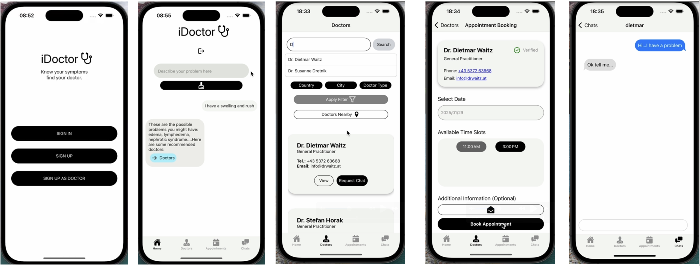

# iDoctor

[]()
[]()

iDoctor is a mobile healthcare platform that helps users identify potential health issues, connect with verified doctors, and book appointments — all powered by AI and microservices. The app combines a **React Native frontend**, a **Spring Boot backend**, and **Flask-based machine learning microservices** to deliver personalized health insights and seamless doctor-patient interactions.

## 

## Overview

iDoctor enables users to describe their symptoms in natural language and get **AI-powered predictions** of possible illnesses. The app then recommends **nearby doctors** specialized in those conditions, allows **direct chat with verified doctors**, and supports **appointment scheduling** with integrated calendar management for doctors.

---

## Features

- **Symptom-based AI diagnosis** using GPT-3.5 and Spacy for symptom extraction.
- **Doctor recommendations** by mapping predicted illnesses to doctor specializations.
- **User, Doctor, and Admin accounts** with role-based access and document verification for doctors.
- **Secure private chat system** where users can request to chat with doctors (doctors can approve or decline).
- **Appointment booking system** with calendar integration for doctors.
- **Microservices architecture**:
  - `Chatbot`: Orchestrates disease prediction and doctor mapping.
  - `Disease Predictor`: Predicts illnesses from user-described symptoms.
  - `Doctor Search`: Maps predicted illnesses to relevant doctor types.

---

## Tech Stack

- **Frontend**: React Native (JavaScript/TypeScript)
- **Backend**: Java Spring Boot (REST API)
- **Machine Learning Services**: Python (Flask, Spacy, OpenAI GPT-3.5 API)
- **Database**: H2 (development)

---

## Installation

### Prerequisites

- Node.js (v18+), npm
- Java 17+, Maven or Gradle
- Python 3.9+
- PostgreSQL (or H2 for local testing)
- OpenAI API Key (for ML services)

---

### Frontend (React Native)

```bash
cd frontend
npm install
npm start
```

---

### Backend (Spring Boot)

```bash
cd backend/iDoctor
mvn spring-boot:run
```

---

### ML Microservices (Flask)

```bash
cd src/disease_predictor
python3 predict_disease_bot.py

cd src/doctor_type_search
python3 doctor_type_search_bot.py

cd src/chatbot
python3 chatbot.py
```

---
